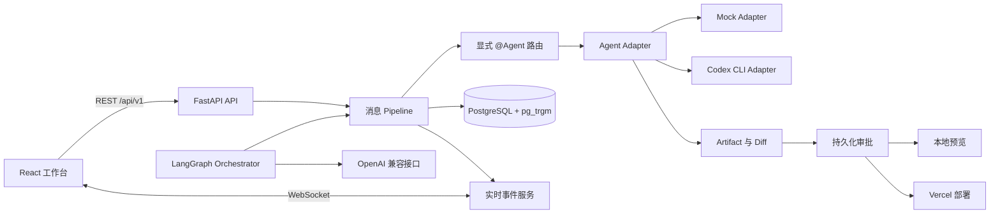

# AgentHub 开发计划

本文档将 AgentHub 首版拆分为 11 个可独立执行、验证和验收的阶段。每个阶段均包含目标、前置条件、交付物、可直接交给 Codex 的完整提示词、验收标准和注意事项。

阶段开发必须遵守根目录 `AGENTS.md`。当前阶段未通过验收时，不得开始依赖它的后续阶段。

---

## 1. 产品边界

AgentHub 是聊天式多 Agent 软件交付工作台。开发者可以像在 IM 群聊中 `@同事` 一样，通过 `@Agent` 分派开发任务，并在同一条交付链路中查看执行状态、审查代码改动、预览网页和确认部署。

首版固定范围：

- 本地单用户，不实现账号、组织、多租户和计费。
- Agent 接入包括确定性的 Mock Adapter 和真实 Codex CLI Adapter。
- Orchestrator 通过 OpenAI 兼容接口完成结构化计划生成和结果汇总。
- PostgreSQL 保存业务数据，并使用 `pg_trgm` 支持历史消息的全文和模糊搜索。
- 支持本地 HTML/CSS/JS 预览和 Vercel 部署。
- 不实现 Netlify、云端 Agent 执行节点或任意服务器托管。

首版核心闭环：

```text
会话 -> @Agent 路由 -> Agent 执行 -> Diff 审核 -> 网页预览 -> Vercel 部署
```

---

## 2. 总体架构



普通消息 Pipeline 负责确定性步骤：保存消息、解析显式 `@Agent`、调用 Adapter、保存执行事件和推送 WebSocket。显式点名多个 Agent 时只做并行分发。

Orchestrator 只负责复杂任务：生成并验证结构化计划、匹配 Agent 能力、执行依赖调度、条件分支、重试和结果汇总。LLM 输出必须视为不可信输入，校验通过后才可执行。

---

## 3. 目标目录

```text
AgentHub/
|-- AGENTS.md
|-- DEVELOPMENT_PLAN.md
|-- README.md
|-- .env.example
|-- .gitignore
|-- backend/
|   |-- pyproject.toml
|   |-- alembic.ini
|   |-- alembic/
|   |-- prompts/
|   |   |-- orchestrator/
|   |   `-- adapters/
|   |-- src/agenthub/
|   |   |-- api/
|   |   |-- core/
|   |   |-- db/
|   |   |-- models/
|   |   |-- repositories/
|   |   |-- schemas/
|   |   |-- services/
|   |   |-- adapters/
|   |   |-- orchestrator/
|   |   `-- main.py
|   `-- tests/
|-- frontend/
|   |-- src/
|   |   |-- api/
|   |   |-- components/
|   |   |-- features/
|   |   |-- hooks/
|   |   |-- routes/
|   |   |-- schemas/
|   |   `-- styles/
|   |-- tests/
|   `-- e2e/
|-- infra/
|   |-- compose.yaml
|   |-- backend.Dockerfile
|   `-- frontend.Dockerfile
`-- docs/
    |-- architecture/
    |-- api/
    `-- acceptance/
```

目录只在对应阶段创建。禁止提前建立没有实际使用者的抽象层。

---

## 4. 公共契约

- REST API 前缀统一为 `/api/v1`。
- WebSocket 地址为 `/ws/conversations/{conversation_id}`。
- 所有资源 ID 使用 UUID。
- 数据库保存 UTC；API 时间使用带时区的 ISO 8601；前端按本地时区显示。
- WebSocket 和 Adapter 事件均使用可判别联合类型。
- 后端 Pydantic Schema 与前端 TypeScript 类型必须同源生成或进行自动契约校验。
- Prompt 保存在 `backend/prompts/` 的版本化文件中，由运行时代码加载。
- 写入代码、应用 Diff、启动预览和发起部署必须通过持久化审批。

WebSocket 事件信封：

```json
{
  "event_id": "00000000-0000-0000-0000-000000000000",
  "conversation_id": "00000000-0000-0000-0000-000000000000",
  "execution_id": "00000000-0000-0000-0000-000000000000",
  "sequence": 1,
  "type": "message.delta",
  "timestamp": "2026-01-01T00:00:00Z",
  "payload": {}
}
```

同一执行中的 `sequence` 必须单调递增。服务端持久化可重放事件；客户端按 `event_id` 去重，并在重连时提交最后确认序号。

---

## 5. 阶段依赖

```text
Phase 1  Monorepo 脚手架
   -> Phase 2  数据库 Schema 与仓储层
      -> Phase 3  Agent Adapter
         -> Phase 4  P0 单聊后端
            -> Phase 5  P0 聊天前端
               -> Phase 6  Agent 管理、群聊与并行执行
                  -> Phase 7  隔离工作区、Artifact 与 Diff
                     -> Phase 8  本地预览与 Vercel 部署
                        -> Phase 9  Orchestrator 与 LangGraph
                           -> Phase 10 历史搜索、导出与统计
                              -> Phase 11 安全、容器化与发布验收
```

---

## 6. 阶段状态

| Phase | 名称 | 状态 |
|------:|------|------|
| 1 | Monorepo 脚手架与配置 | 已完成 |
| 2 | 数据库 Schema、迁移与仓储层 | 待开始 |
| 3 | Agent Adapter 与执行协议 | 待开始 |
| 4 | P0 单聊后端与实时事件 | 待开始 |
| 5 | P0 聊天前端 | 待开始 |
| 6 | Agent 管理、群聊、@路由与并行执行 | 待开始 |
| 7 | 隔离工作区、Artifact 与 Code Diff | 待开始 |
| 8 | 本地预览与 Vercel 部署 | 待开始 |
| 9 | Orchestrator 与 LangGraph | 待开始 |
| 10 | 历史搜索、导出与使用统计 | 待开始 |
| 11 | 安全、可观测性、容器化与发布验收 | 待开始 |

---

## 7. Codex 通用约束

每个 Phase 的提示词都默认包含以下约束：

1. 开始前阅读 `AGENTS.md`、本文件当前 Phase 和现有代码，不猜测尚未确认的实现。
2. 只实现当前阶段，禁止提前开发后续产品能力。
3. 先列出假设、范围和成功标准；存在高风险歧义时先询问。
4. 优先编写能验证行为的失败测试，再完成最小实现。
5. 后端使用 Python 3.13、FastAPI、Pydantic v2、SQLAlchemy 2 async、asyncpg、Alembic、pytest、Ruff 和严格类型检查。
6. 前端使用 React 19、Vite、TypeScript strict、React Router、TanStack Query、Lucide、Vitest 和 Playwright。
7. 代码使用有信息量的中文注释，不写逐行翻译式注释。
8. 禁止提交、打印或记录真实密钥；示例使用 `YOUR_API_KEY_HERE` 等明显假值。
9. 子进程必须通过参数数组启动，禁止 `shell=True`，并校验 `cwd` 位于已注册项目范围内。
10. 每阶段结束时报告改动文件、实际命令、真实结果、未执行项和环境限制。

---

## Phase 1：Monorepo 脚手架与配置

### 目标

建立 `backend/`、`frontend/`、`infra/`、`docs/` 四部分 Monorepo 脚手架，不实现聊天、数据库业务或 Agent 调用。

### 前置条件

- 项目根目录存在 FastAPI Hello World 示例。
- Python 3.13、uv 和 Node.js 可用。
- `.idea` 和 `.venv` 必须保留。

### 交付物

- `backend/` 中采用 `src/agenthub` 布局的 FastAPI 应用。
- `/health/live` 和 `/health/ready` 健康端点。
- 基于 `pydantic-settings` 的类型化配置。
- React 19 + Vite + TypeScript strict 工作台框架。
- `.env.example`、`.gitignore`、README、基础测试和质量命令。

### 完整提示词

```text
你正在 D:\codexWorkPlace\AgentHub 执行 AgentHub Phase 1。先阅读 AGENTS.md 和 DEVELOPMENT_PLAN.md 的 Phase 1，并检查当前目录。项目目前只有根目录 FastAPI Hello World 示例、test_main.http、.idea 和 .venv；不要删除 .idea 或 .venv。

目标是建立 backend、frontend、infra、docs 四部分的 Monorepo 脚手架，不实现聊天、数据库业务或 Agent 调用。后端使用 Python 3.13、uv、FastAPI、Pydantic v2，采用 src/agenthub 包布局；创建清晰 app 入口，实现 /health/live 与 /health/ready，并建立基于 pydantic-settings 的类型化配置。配置不得在导入时连接外部服务，错误不得打印敏感值。建立 pyproject.toml 中的运行、开发、测试、Ruff 和严格类型检查依赖及配置。

前端使用 React 19、Vite、TypeScript strict、React Router、TanStack Query 和 Lucide。首屏只需要安静、紧凑的工作台框架与基础路由，不做营销页。建立 lint、typecheck、test、build、e2e 脚本；组件必须具备可访问的语义结构。

创建根目录 .env.example，只使用 YOUR_API_KEY_HERE、YOUR_DATABASE_URL_HERE 这类明显假值；创建适合 Python、Node、IDE、环境文件和 AgentHub 运行产物的 .gitignore。README 写明 Windows PowerShell 使用 npm.cmd、开发命令、目录和当前依赖。先把根目录 main.py 的有效健康示例迁移到正式包，验证新入口后再删除旧示例；test_main.http 若保留则更新到新健康地址，否则用自动测试替代并说明。

为配置默认值、缺失必需配置的安全错误和两个健康端点写测试。运行后端导入、Ruff、类型检查和 pytest；运行前端 lint、typecheck、单测和 build。Docker 不可用时只检查文件语法和内容，不声称容器已启动。完成后报告文件、命令、真实结果和任何环境限制。
```

### 验收标准

- 后端可导入，两个健康端点测试通过。
- 配置默认值和缺失配置的安全错误测试通过。
- Ruff、严格类型检查和 pytest 通过。
- 前端 lint、typecheck、单测和 build 通过。
- 示例配置不存在真实密钥，中文文件为有效 UTF-8。

### 注意事项

- 本阶段不连接数据库、不调用 Agent、不实现聊天。
- Docker 只做静态检查，不把未启动写成已运行。

---

## Phase 2：数据库 Schema、迁移与仓储层

### 目标

建立 PostgreSQL 数据模型、Alembic 迁移和异步仓储层，不实现聊天 API 或业务编排。

### 前置条件

- Phase 1 后端质量检查和前端构建已通过。
- 可使用独立测试 PostgreSQL；若不可用，必须明确保留集成门禁。

### 交付物

- SQLAlchemy 2 async engine、session 和事务管理。
- Alembic 环境及可逆首个迁移。
- Project、Agent、Conversation、Message、AgentExecution、Task、TaskDependency、Artifact、Approval、Deployment、UsageEvent。
- API Schema、领域对象、ORM 模型与 Repository 边界。
- 约束、索引、项目隔离和迁移测试。

### 完整提示词

```text
执行 AgentHub Phase 2。先确认 Phase 1 的后端质量检查与前端构建记录通过，然后阅读 AGENTS.md 的核心对象、UTC、UUID、仓储和项目隔离规则。只建立数据层，不实现聊天 API 或业务编排。

使用 SQLAlchemy 2 async、asyncpg 和 Alembic。创建 Project、Agent、Conversation、Message、AgentExecution、Task、TaskDependency、Artifact、Approval、Deployment、UsageEvent。所有主键使用 UUID，时间使用数据库可正确保存的 UTC aware timestamp；定义明确枚举、外键删除策略、唯一约束、检查约束和常用查询索引。启用 pg_trgm；Conversation、Message、执行、Artifact、审批、部署和用量都必须能追溯到 project_id。TaskDependency 必须防止自依赖；Approval 保存动作类型、摘要、内容哈希、状态、决定时间和决定结果。敏感配置只保存引用，不保存明文凭据。

API Schema、领域对象和 ORM 模型职责分离。Repository 不得向路由层返回 ORM 实例，事务提交由服务层显式控制。

编写迁移 upgrade 到 head、downgrade 后再 upgrade、外键、唯一约束、索引存在性、UTC、仓储事务和 project_id 隔离测试。测试数据库必须与开发数据库隔离。实际 PostgreSQL 不可用时，不能使用 SQLite 假装验证 PostgreSQL 扩展；运行可行的静态检查并保留明确的 PostgreSQL 集成门禁。最后运行 Ruff、类型检查和测试并报告结果。
```

### 验收标准

- 空数据库可 upgrade、downgrade 并再次 upgrade。
- `pg_trgm` 和常用查询索引存在。
- 外键、唯一约束、自依赖限制和项目隔离测试通过。
- Repository 不返回 ORM 实例，回滚行为有测试。
- 数据库门禁未通过时不得进入 Phase 3。

### 注意事项

- 不使用 SQLite 代替 PostgreSQL 扩展集成测试。
- 本阶段不创建聊天路由或 WebSocket。

---

## Phase 3：Agent Adapter 与执行协议

### 目标

建立统一 Agent 执行协议，完成确定性 Mock Adapter 和具备安全边界的 Codex CLI Adapter。

### 前置条件

- Phase 2 数据模型、迁移和 Repository 验收通过。
- Codex CLI 可用性必须在当前环境重新探测。

### 交付物

- `AgentTask`、`AgentEvent`、`AgentResult`、`AgentCapability` 和稳定错误码。
- `healthcheck()`、`run()`、`cancel()` 统一契约。
- 可脚本控制的 Mock Adapter。
- Codex CLI 可用性探测、流式读取、超时、取消和退出码映射。
- Adapter 契约测试和真实 Codex 条件式冒烟门禁。

### 完整提示词

```text
执行 AgentHub Phase 3。先阅读 AGENTS.md 的 Adapter、安全、子进程和事件规范，确认 Phase 2 通过。此阶段不创建聊天路由和 UI。

定义 AgentTask、AgentEvent、AgentResult、AgentCapability、AdapterHealth、统一错误码和执行状态。AgentEvent 使用可判别联合类型，至少覆盖 content.delta、execution.status、execution.error、execution.usage、artifact.created；同一执行的序号必须单调递增。

实现确定性 Mock Adapter：输入脚本可控制内容分段、Artifact、用量、失败、超时和取消，测试不能依赖随机时间。实现 Codex CLI Adapter：先探测可执行文件和版本；使用 asyncio.create_subprocess_exec 与参数列表，禁止 shell=True；cwd 必须通过已注册项目或工作区校验；并发读取 stdout/stderr，限制单行和总缓冲大小；支持超时、主动取消、进程树终止、退出码映射和资源回收。不要猜测 Codex CLI 输出格式，先检查本机帮助或已有文档证据，并为解析样例建立 fixture。

平台错误映射为稳定错误码，不得把凭据、隐私路径或完整 stderr 发送到前端。Codex CLI 不可用时测试必须明确 skip 原因，Mock 测试全部继续执行；发布前仍需真实 Codex 冒烟测试。运行 Ruff、类型检查和所有 Adapter 测试并报告结果。
```

### 验收标准

- Mock Adapter 的成功、失败、超时、取消、Artifact 和用量测试通过。
- Codex CLI 不可用时给出明确探测结果和 skip 原因。
- 子进程未使用 `shell=True`，`cwd` 经过校验。
- Adapter 不承担业务路由、审批或数据库事务。

### 注意事项

- 当前环境曾出现 `codex.exe` 执行被拒绝，不能把可发现文件等同于可用。
- 真实 Codex 冒烟测试是发布门禁，不影响 Mock 开发继续进行。

---

## Phase 4：P0 单聊后端与实时事件

### 目标

实现会话、消息、单 Agent 执行 API 和 WebSocket 流式事件，并支持持久化、取消和断线恢复。

### 前置条件

- Phase 2 数据层和 Phase 3 Mock Adapter 契约测试通过。

### 交付物

- 会话与消息 REST API。
- 单 Agent 执行服务。
- WebSocket 事件推送、事件持久化和游标补发。
- 执行取消、失败映射和会话隔离测试。

### 完整提示词

```text
执行 AgentHub Phase 4，只实现 P0 单聊后端。先确认数据库和 Mock Adapter 测试通过，阅读公共 REST、WebSocket、UUID、UTC 和事件信封契约。

实现会话创建、查询和消息提交 API。单聊会话绑定一个已启用 Agent。用户提交消息后，服务层在事务中保存 Message 和 AgentExecution，然后异步调用 Adapter.run()；每个 AgentEvent 先持久化，再通过 WebSocket 推送，最后组装并保存完整 Agent Message。

WebSocket 事件统一使用 {event_id, conversation_id, execution_id, sequence, type, timestamp, payload}。同一执行的 sequence 单调递增；客户端按 event_id 去重。服务端按客户端最后确认的 sequence 补发遗漏事件。实现执行取消 API，取消状态必须持久化，并通过 WebSocket 发送最终事件。

编写后端端到端测试：用户消息经过 Mock Adapter 分段返回并形成完整 Agent 消息；事件序号稳定；断线后按游标补发且无重复；取消形成最终状态；Adapter 失败保存安全错误；不存在或跨项目资源被拒绝；两个会话互不串流。不要实现群聊、@路由或 Orchestrator。运行迁移、Ruff、类型检查和完整后端测试并报告结果。
```

### 验收标准

- 单条消息经 Mock Adapter 流式返回并完整持久化。
- 断线重连补发无丢失、无重复。
- 取消和失败均形成唯一最终状态。
- 两个会话事件互不串流，跨项目资源访问被拒绝。

### 注意事项

- 路由层只做协议转换，业务逻辑和事务放在服务层。
- 不提前实现群聊和自动任务拆解。

---

## Phase 5：P0 聊天前端

### 目标

实现单聊工作台前端，并对接已验收的 REST API 与 WebSocket 契约。

### 前置条件

- Phase 4 API、WebSocket 和事件恢复测试通过。
- 实际 OpenAPI 和事件 Schema 可读取。

### 交付物

- 左侧会话列表、主消息区、输入区和 Agent 选择器。
- 文本、Markdown、代码块和流式内容展示。
- 加载、空、失败、断连、重连、取消和重试状态。
- 桌面及移动端组件测试和 Playwright 测试。

### 完整提示词

```text
执行 AgentHub Phase 5，只实现 P0 单聊前端并对接已验收后端。先读取实际 OpenAPI 和事件 Schema，不手写另一套会漂移的类型；采用生成类型或自动契约检查。保持 React 19、TypeScript strict、React Router、TanStack Query 和 Lucide。

建立安静、紧凑的软件交付工作台：左侧会话列表，中间消息区，底部输入区和 Agent 选择器。支持新建、切换会话，显示文本、Markdown、代码块和流式内容。所有消息使用稳定 key；WebSocket 事件按 event_id 去重，状态更新不得导致消息重复、跳动或内容串接。

使用 TanStack Query 管理 REST 服务端状态。实现连接中、已连接、断连和重连中状态；断连时提供非阻塞提示并自动重连。界面覆盖加载、空数据、失败、取消和重试。使用语义化 HTML、键盘可达焦点和明确 aria 标签。

使用 Vitest/RTL 和 Playwright 验收桌面与移动端：空会话、新建会话、发送消息、流式回复、断连重连、取消执行、长 Markdown 和代码块不溢出。运行 lint、typecheck、单测、build 和 e2e 并报告结果。
```

### 验收标准

- 单聊完整链路可用，流式消息无重复和布局跳动。
- 断连状态可见，重连后补全消息。
- 桌面与移动端无文字遮挡和不可达操作。
- lint、typecheck、Vitest、build 和 Playwright 通过。

### 注意事项

- 不实现营销页、Agent 管理视图或复杂任务编排界面。
- 前端类型必须与后端 Schema 同源或自动核对。

---

## Phase 6：Agent 管理、群聊、@路由与并行执行

### 目标

增加 Agent 注册管理、群聊、显式 `@Agent` 路由和多 Agent 并发执行，同时保持单聊契约兼容。

### 前置条件

- Phase 5 单聊 E2E 通过。

### 交付物

- Agent 注册、能力声明、启停 API 和管理界面。
- 单次解析的 `@Agent` 路由器。
- 基于 `asyncio.TaskGroup` 的并发执行。
- 群聊参与者和 `@` 输入建议。
- 单聊回归、并发、部分失败和取消测试。

### 完整提示词

```text
执行 AgentHub Phase 6。在不改变既有单聊契约的前提下增加 Agent 管理、群聊、显式 @路由和并行执行。本阶段绝不实现 LLM 自动拆解或 LangGraph。

后端实现 Agent 注册、查询、能力声明和启停。群聊会话支持多个参与 Agent。消息进入 Pipeline 后只解析一次 @Agent名，按名称边界识别所有唯一点名；未知或禁用 Agent 返回明确安全错误。点名多个 Agent 时使用 asyncio.TaskGroup 并发调用 Adapter，每个 Agent 的事件、执行和最终消息独立持久化。定义部分失败、取消传播和最终会话状态，按事件序号稳定推送。

前端增加紧凑 Agent 管理视图、能力和启停状态、群聊参与者及 @输入建议。结果按 Agent 身份独立展示，流式并发不得串接内容或移动已有消息。

为解析器名称边界、未知/禁用 Agent、重复点名、并发开始、部分失败、取消和两个会话隔离写后端测试；为 @建议和并发消息写组件与 Playwright 测试。运行全栈质量命令和 E2E，确认 Phase 5 单聊无回归。
```

### 验收标准

- Agent 注册、能力、启停和管理界面可用。
- 多个显式点名 Agent 并发执行，事件和消息彼此隔离。
- 未知、禁用、重复点名和部分失败行为有固定测试。
- 单聊 E2E 无回归。

### 注意事项

- 本阶段只处理显式点名，不进行隐式意图识别或任务拆解。
- 并发执行必须明确取消传播和部分失败语义。

---

## Phase 7：隔离工作区、Artifact 与 Code Diff

### 目标

为可写任务建立隔离 Git worktree、Artifact 登记、Diff 审核和持久化审批。

### 前置条件

- Phase 6 群聊和并发执行验收通过。
- 目标项目注册与受信任根目录边界明确。

### 交付物

- Project Git 校验和隔离 worktree 生命周期。
- Artifact 模型与服务。
- Diff 生成、展示和应用 API。
- `approval.required` 与 `approval.resolved` 持久化流程。
- 路径逃逸、冲突、拒绝和清理测试。

### 完整提示词

```text
执行 AgentHub Phase 7。目标是隔离工作区、Artifact 和 Code Diff，不实现预览或部署。所有文件改动均视为高风险操作，严格执行持久化审批。

可写任务要求目标 Project 是已注册且验证通过的 Git 仓库。每次执行在 `<project>/.agenthub/worktrees/<execution_id>` 创建隔离 worktree，Agent 子进程 cwd 只能是该目录。对所有输入路径进行规范化、根目录包含和符号链接越界检查；拒绝路径逃逸、未注册目录和目标分支危险操作。

所有文件、补丁和报告登记为 Artifact，至少保存 project_id、execution_id、类型、相对路径、内容哈希、大小、创建时间和元数据。使用 Git 生成可审查 unified diff，正确标记二进制文件。应用 Diff 前创建 approval.required 事件和 Approval 记录，审批绑定动作摘要及内容哈希；用户批准后产生 approval.resolved 并执行。内容变化时原批准失效。

编写路径逃逸、符号链接越界、二进制文件、补丁冲突、拒绝应用、审批刷新恢复、取消执行和 worktree 清理测试。清理失败必须记录可操作错误，但不得删除用户目标分支。运行 Ruff、类型检查和测试并报告结果。
```

### 验收标准

- 未注册或非 Git 项目不能创建可写执行。
- 路径逃逸和符号链接越界被拒绝。
- 未批准不能应用 Diff，内容改变会使旧批准失效。
- 二进制、冲突、拒绝和清理失败行为可验证。

### 注意事项

- 禁止使用 `shell=True` 或字符串拼接命令。
- 不在本阶段启动预览或调用部署服务。

---

## Phase 8：本地预览与 Vercel 部署

### 目标

实现受控 HTML/CSS/JS Artifact 本地预览和 Vercel 部署，不支持 Netlify。

### 前置条件

- Phase 7 Artifact、Diff 和审批流程通过。

### 交付物

- 独立临时目录中的静态网页预览服务。
- 前端 sandboxed iframe 预览界面。
- Vercel Adapter、部署审批、状态流和结果 URL。
- Mock Vercel 测试和真实部署条件式门禁。

### 完整提示词

```text
执行 AgentHub Phase 8。首版只预览受控 HTML/CSS/JS Artifact，只部署到 Vercel，不实现 Netlify 或任意应用服务托管。

本地预览仅接受已登记且属于当前项目的 HTML/CSS/JS Artifact。复制到独立临时目录并限制资源范围，后端提供受控静态资源服务，前端使用 sandboxed iframe 展示。启动预览前必须持久化审批；提供启动、状态和停止 API。限制目录大小、文件类型、并发数量和资源访问，停止或过期后清理临时目录及进程。

实现 Vercel Adapter。凭据从环境变量引用读取，不保存明文。部署前创建绑定内容哈希的审批；批准后上传并通过 WebSocket 推送准备、上传、构建、完成、失败和取消状态。成功保存 Deployment 和 URL；失败映射为稳定错误码，日志对 Token、连接信息和内部路径脱敏。

测试预览启动/停止、端口冲突、失效文件、越界资源、过期清理、取消部署，以及 Mock Vercel 成功、失败、超时和取消。真实部署仅在具备凭据时执行并记录为发布集成门禁。运行全栈质量命令并报告结果。
```

### 验收标准

- 预览只能读取当前 Artifact 范围内的静态文件。
- iframe 使用 sandbox，启动和停止流程经过审批且可清理。
- Mock Vercel 成功、失败、超时和取消测试通过。
- 部署日志不包含 Token 或内部绝对路径。

### 注意事项

- 不执行用户项目中的任意开发服务器。
- 本阶段不实现 Netlify 或云端执行节点。

---

## Phase 9：Orchestrator 与 LangGraph

### 目标

在已有 Message Pipeline、Adapter、Artifact 和 Approval 契约上增加复杂任务规划与依赖调度。

### 前置条件

- Phase 8 从 Agent 执行到交付的确定性链路通过。
- OpenAI 兼容接口配置、Prompt 加载机制和 Fake LLM 测试方式明确。

### 交付物

- 版本化 Orchestrator 计划 Prompt。
- 经过 Pydantic 校验的结构化执行计划。
- LangGraph 状态图和依赖调度器。
- 串行、并行、条件、重试、取消、恢复和人机确认。
- Fake LLM 确定性测试与条件式真实 LLM 测试。

### 完整提示词

```text
执行 AgentHub Phase 9。只在已有 Message Pipeline、Adapter、Artifact 和 Approval 契约上增加 Orchestrator，不重写这些模块。

通过 LLM_BASE_URL、LLM_API_KEY、LLM_MODEL 配置 OpenAI 兼容接口。Orchestrator 计划 Prompt 放在 backend/prompts/orchestrator/ 的版本化文件中，由运行时代码加载，注明输入输出 Schema。LLM 输出必须解析为 Pydantic 结构化计划，并经过依赖图、能力、执行策略和安全边界校验后才可运行。

使用 LangGraph 实现计划生成、能力匹配、依赖调度、子任务执行、条件分支、结果汇总和人机确认节点。子任务状态为 pending、running、succeeded、failed、retrying、skipped、cancelled。失败最多重试两次，之后按计划策略跳过或终止。高风险工具动作继续使用已有 Approval，不得绕过审批。

默认测试使用 Fake LLM 和确定性 Adapter，覆盖依赖环拒绝、并行汇合、串行依赖、条件分支、重试耗尽、部分失败、取消、恢复和审批暂停。真实 LLM 测试作为具备凭据时的条件式门禁。运行 Ruff、类型检查和测试并报告结果。
```

### 验收标准

- 非法结构、依赖环和不存在能力的计划被拒绝。
- 串行、并行、条件、重试和汇合行为测试通过。
- 取消、恢复和审批暂停不会产生重复执行。
- Prompt 只有一份运行时来源并带版本标识。

### 注意事项

- LLM 输出不可信，不能直接转成命令或文件操作。
- Orchestrator 不重写普通消息 Pipeline。

---

## Phase 10：历史搜索、导出与使用统计

### 目标

实现项目隔离的历史搜索、可审计 Markdown 导出和口径明确的使用统计。

### 前置条件

- Phase 9 复杂任务状态、Artifact 和 UsageEvent 数据稳定可追溯。

### 交付物

- PostgreSQL 全文和模糊搜索 API。
- 会话 Markdown 导出。
- 调用次数、Token、成功率、响应时间和 Agent 分布统计。
- 搜索、导出和统计前端视图及 E2E。

### 完整提示词

```text
执行 AgentHub Phase 10。在已有 PostgreSQL 数据上实现历史搜索、Markdown 导出和使用统计，不引入外部搜索服务。

使用 PostgreSQL 全文搜索和 pg_trgm 模糊匹配。搜索必须要求 project_id，支持关键词、会话、Agent、时间范围、分页和稳定排序。为中文、模糊匹配、时间筛选、跨项目拒绝和索引使用编写测试。

实现会话 Markdown 导出，包含会话信息、消息身份、Agent、UTC 时间、正文和 Artifact 链接。正确处理 Markdown 特殊字符和代码围栏。导出不得包含密钥、内部推理、完整 stderr 或敏感诊断。

根据 UsageEvent 统计调用次数、Token、成功率、响应时间和 Agent 分布。Token 未上报时显示未知，不得按零计入。明确成功率分母、取消处理、P50/P95 计算和时区边界，并用固定样例测试。

前端提供紧凑搜索、导出和统计视图，覆盖加载、空、失败和时间筛选状态。运行后端、前端和 E2E 质量命令并报告结果。
```

### 验收标准

- 中文和模糊搜索有效，项目隔离严格。
- 分页、排序和时间筛选稳定，常用查询使用预期索引。
- 导出可正常阅读且不包含敏感数据。
- 未知 Token 不显示为零，统计公式有固定测试。

### 注意事项

- 不引入 Elasticsearch、Meilisearch 等外部搜索服务。
- 导出文件使用 UTF-8。

---

## Phase 11：安全、可观测性、容器化与发布验收

### 目标

完成首版发布加固、可观测性、容器化和端到端验收，不增加新的产品模块。

### 前置条件

- Phase 1 至 Phase 10 的必需门禁通过。
- 条件式真实 Codex、LLM 和 Vercel 集成门禁已明确环境要求。

### 交付物

- 统一错误响应、结构化脱敏日志、请求追踪和 Prometheus 指标。
- REST、WebSocket、搜索和外部调用的速率、并发和大小限制。
- 后端、前端和 PostgreSQL Docker Compose。
- 安全测试、完整 Playwright E2E 和发布门禁报告。

### 完整提示词

```text
执行 AgentHub Phase 11。这是首版发布加固阶段，不增加新的产品模块。先汇总前 10 个阶段的实际门禁和未完成集成项，任何核心缺口都先修复再验收。

实现统一 API 错误响应和结构化 JSON 日志，包含 request_id、稳定错误码、路径、状态和耗时；对 Authorization、Cookie、连接串、查询参数、外部 stderr 和内部路径脱敏。增加 Prometheus 指标，包括请求数、延迟、错误率、执行状态和 WebSocket 连接数。为 REST、WebSocket、消息提交、搜索和外部调用设置合理速率、并发、输出及文件大小限制。

验证路径穿越、提示词注入绕过审批、Markdown XSS、命令参数注入、SSRF、跨项目 ID 访问、超大输出、超时、取消和应用关闭资源清理。不得通过记录敏感原文换取可观测性。

完成 PostgreSQL、后端和前端 Docker Compose。PostgreSQL 启用 pg_trgm；后端和前端使用可复现构建。Docker 不可用时只进行 Compose 和 Dockerfile 静态检查，明确标记容器未启动。

Playwright 覆盖单聊、群聊、显式 @Agent、并行执行、Orchestrator、Diff 审批、预览、部署失败与恢复。发布门禁要求后端测试、Ruff、严格类型检查、前端 lint、typecheck、单测、build、Playwright 和密钥扫描全部通过。输出最终门禁报告和条件式集成项结果。
```

### 验收标准

- 错误响应、日志和指标契约稳定，日志中无敏感值。
- 路径、XSS、命令注入、SSRF 和跨项目访问测试通过。
- Docker 可用时全栈容器可启动并通过健康检查。
- 全部自动化发布门禁通过；未执行的真实集成项有明确原因。

### 注意事项

- 不因发布加固增加账号、多租户、Netlify 或云端执行功能。
- 未运行的验证不能报告为已通过。

---

## 8. 文档验证

修改本文件后必须执行以下静态检查：

1. 按 UTF-8 严格解码，无 U+FFFD。
2. 不存在被错误替换为连续问号的中文文本。
3. Phase 标题连续为 1 至 11。
4. 每个 Phase 均包含目标、前置条件、交付物、完整提示词、验收标准和注意事项。
5. Markdown 代码围栏成对。
6. 不包含真实密钥模式或未完成占位词。
7. `AGENTS.md` 与本文件中的目录、阶段编号、公共契约和标准命令保持一致。
