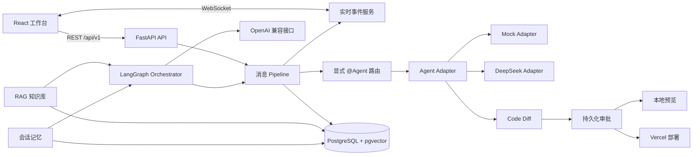

# AgentHub 开发计划

本文档将 AgentHub 首版拆分为 11 个可独立执行、验证和验收的阶段。每个阶段均包含目标、前置条件、交付物、可直接交给开发者的完整提示词、验收标准和注意事项。

阶段开发必须遵守根目录 `AGENTS.md`。当前阶段未通过验收时，不得开始依赖它的后续阶段。

---

## 1. 产品边界

AgentHub 是**以群聊写代码为核心的**多 Agent 软件交付工作台。开发者可以在群聊中 `@子Agent` 分派开发任务，也可以直接发送需求，由 Orchestrator 自动拆解并调度子 Agent 各司其职。

首版固定范围：

- 本地单用户，不实现账号、组织、多租户和计费。
- 单聊仅保留 **DeepSeek**（通过 OpenAI 兼容接口），移除 Claude Code 和 Codex CLI。
- 群聊围绕代码生成场景，预置多个垂直子 Agent（需求分析、架构设计、代码生成、代码审查、测试、技术报告撰写）。
- Agent 接入包括确定性 Mock Adapter 和真实 DeepSeek Adapter。
- Orchestrator 通过 LangGraph + OpenAI 兼容接口完成结构化计划生成、子 Agent 调度和结果汇总。
- PostgreSQL + pgvector：业务数据 + 向量存储，支撑 RAG 知识库和会话记忆。
- 支持 Code Diff 审核。
- 支持本地 HTML/CSS/JS 预览和 Vercel 部署。
- 高风险动作必须由用户明确批准。

首版核心闭环：

```text
群聊 -> 需求输入 -> Orchestrator 拆解 -> 子Agent并行/串行执行 -> Diff审核 -> 网页预览 -> Vercel部署
单聊 -> 选择DeepSeek -> Agent执行
```

---

## 2. 总体架构



普通消息 Pipeline 负责确定性步骤：保存消息、解析显式 `@Agent`、调用 Adapter、持久化事件和推送 WebSocket。显式点名多个 Agent 时只做并行分发。

Orchestrator 负责群聊中未显式 @Agent 的复杂任务：生成结构化计划、匹配子 Agent 能力、调度串行或并行任务、条件分支、重试和结果汇总。LLM 输出视为不可信输入，必须经过 Pydantic 校验和策略检查后才可执行。

RAG 知识库为 Orchestrator 和子 Agent 提供项目上下文检索。会话记忆确保跨时间的对话连贯性。

---

## 3. 目标目录

```text
AgentHub/
|-- AGENTS.md
|-- DEVELOPMENT_PLAN.md
|-- README.md
|-- .env.example
|-- .gitignore
|-- backend/
|   |-- pyproject.toml
|   |-- alembic.ini
|   |-- alembic/
|   |-- prompts/
|   |   |-- orchestrator/
|   |   |-- adapters/
|   |   `-- agents/          # 各子Agent的System Prompt
|   |-- src/agenthub/
|   |   |-- api/
|   |   |-- core/
|   |   |-- db/
|   |   |-- models/
|   |   |-- repositories/
|   |   |-- schemas/
|   |   |-- services/
|   |   |-- adapters/
|   |   |-- orchestrator/
|   |   |-- rag/              # RAG 知识库与会话记忆模块
|   |   `-- main.py
|   `-- tests/
|-- frontend/
|   |-- src/
|   |   |-- api/
|   |   |-- components/
|   |   |-- features/
|   |   |-- hooks/
|   |   |-- routes/
|   |   |-- schemas/
|   |   `-- styles/
|   |-- tests/
|   `-- e2e/
|-- infra/
|   |-- compose.yaml
|   |-- backend.Dockerfile
|   `-- frontend.Dockerfile
`-- docs/
    |-- architecture/
    |-- api/
    `-- acceptance/
```

目录只在对应阶段创建。禁止提前建立没有实际使用者的抽象层。

---

## 4. 公共契约

- REST API 前缀统一为 `/api/v1`。
- WebSocket 地址为 `/ws/conversations/{conversation_id}`。
- 所有资源 ID 使用 UUID。
- 数据库存储 UTC；API 时间使用带时区的 ISO 8601；前端按本地时区显示。
- WebSocket 和 Adapter 事件均使用可判别联合类型。
- 后端 Pydantic Schema 与前端 TypeScript 类型同源生成。
- Prompt 保存在 `backend/prompts/` 的版本化文件中，由运行时代码加载。
- 写入代码、应用 Diff、启动预览和发起部署必须通过持久化审批。

WebSocket 事件信封：

```json
{
  "event_id": "00000000-0000-0000-0000-000000000000",
  "conversation_id": "00000000-0000-0000-0000-000000000000",
  "execution_id": "00000000-0000-0000-0000-000000000000",
  "sequence": 1,
  "type": "message.delta",
  "timestamp": "2026-01-01T00:00:00Z",
  "payload": {}
}
```

同一执行的 `sequence` 必须单调递增。服务端持久化可重放事件，客户端按 `event_id` 去重，并在重连时携带最后确认序号请求补发。

---

## 5. 预置子 Agent 定义

以下是群聊模式下预置的代码生成子 Agent。每个 Agent 具有独立 System Prompt、输入输出规范和能力声明。

### 5.1 需求分析专家

- **能力**：`requirement_analysis`
- **角色**：将用户模糊需求转化为结构化需求规格，识别歧义并追问澄清
- **输入**：用户的自然语言需求描述
- **输出**：结构化需求文档（功能需求、非功能需求、边界条件、验收标准）
- **规则**：
  - 对模糊点必须标注 `[待澄清]` 而不是猜测填补
  - 输出采用统一 Markdown 模板
  - 不涉及技术选型或代码实现

### 5.2 架构设计专家

- **能力**：`architecture_design`
- **角色**：根据需求规格设计系统架构、组件划分、数据流和技术选型
- **输入**：需求分析专家的结构化需求文档
- **输出**：架构设计文档（组件图、数据模型、接口契约、技术栈建议）
- **规则**：
  - 优先选择项目已有技术栈中的方案
  - 设计必须可拆解为独立可实现的子任务
  - 标注每个组件的实现优先级和预估复杂度

### 5.3 代码生成专家

- **能力**：`code_generation`
- **角色**：根据架构设计和规范生成高质量、可运行的代码
- **输入**：架构设计文档 + 需求规格中的验收标准
- **输出**：完整代码文件（含类型标注、错误处理、中文注释）
- **规则**：
  - 遵循项目 AGENTS.md 中的所有编码规范
  - 生成的代码必须通过类型检查
  - 每个公共函数包含完整类型标注和文档字符串
  - 不生成占位符实现（如 `pass`、`TODO`），缺失依赖时明确标注

### 5.4 代码审查专家

- **能力**：`code_review`
- **角色**：审查代码质量、安全性、性能和最佳实践合规性
- **输入**：代码生成专家输出的代码 + 原始需求规格
- **输出**：审查报告（问题分级、具体行号、改进建议、通过/不通过结论）
- **规则**：
  - 按严重程度（阻塞/重要/建议）分级问题
  - 每个问题必须指向具体代码行
  - 安全漏洞（路径穿越、注入、密钥泄露等）一律标为阻塞
  - 不修改代码，只给出审查意见

### 5.5 测试专家

- **能力**：`testing`
- **角色**：根据需求规格和实现代码生成测试用例和测试代码
- **输入**：需求规格中的验收标准 + 代码生成专家的实现代码
- **输出**：测试代码（单元测试 / 集成测试 / 端到端测试） + 覆盖率分析
- **规则**：
  - 优先覆盖验收标准中的每个场景
  - 同时覆盖成功路径和失败路径
  - 使用项目已配置的测试框架
  - 测试代码本身必须可运行

### 5.6 技术报告撰写专家

- **能力**：`documentation`
- **角色**：将分析结果组装成结构化的 Markdown 竞品分析报告或技术文档
- **输入**：`{"task": {...}, "analysis_results": {...}}`
- **输出**：Markdown 格式的完整报告
- **报告结构**：
  ```markdown
  # {task.title}
  ### 概述
  ### 对比总览（表格）
  ### 逐维度深度分析
  ### 关键发现
  ### 风险与建议
  ```
- **规则**：
  - 只使用给定的分析结果，不添加未经验证的信息
  - 数据缺失部分标注 `[数据不足]`
  - 保持客观中立，不使用情绪化语言
  - 表格至少包含 3 列
  - 遵循项目文档规范

### 5.7 群聊路由规则

- **显式 @Agent**：消息中包含 `@Agent名` 时，直接路由到对应子 Agent 执行，多个 @Agent 并行分发。
- **隐式消息（无 @）**：Orchestrator 分析消息意图，生成结构化计划，按依赖关系调度子 Agent 串行或并行执行。
- **未知 Agent**：@不存在的 Agent 时返回安全错误提示可用 Agent 列表。

---

## Phase 1：项目骨架与基础设施

### 目标
搭建 Python 后端项目骨架、FastAPI 应用工厂、类型化配置、数据库会话与迁移基础设施、Docker Compose 静态配置。

> **状态：✅ 已验收。** 本阶段交付物已通过全部验收标准。

---

## Phase 2：业务模型、枚举与数据库迁移

### 目标
定义全部业务 ORM 模型、枚举和 Alembic 迁移，确保 PostgreSQL 中创建所有表、索引和约束。

> **状态：✅ 已验收。**

---

## Phase 3：Pydantic Schema、仓储层与核心服务

### 目标
实现 Pydantic v2 Schema、仓储层和服务层，完成聊天消息链路的核心业务逻辑。

> **状态：✅ 已验收。**

---

## Phase 4：REST API、WebSocket、Mock Adapter 与后端验收

### 目标
实现完整的 REST API 路由、WebSocket 实时推送、Mock Adapter 和全栈后端测试。

> **状态：✅ 已验收。**

---

## Phase 5：P0 聊天前端

### 目标

实现单聊前端工作台，支持 DeepSeek 作为单聊 Agent 提供方。

### 前置条件

- Phase 4 REST API、WebSocket 和 Mock Adapter 通过验收。
- DeepSeek API Key 已配置。

### 交付物

- 左侧会话列表，中间消息区，底部输入区的三栏工作台布局。
- 单聊入口仅提供 DeepSeek 选项。
- 消息流式展示、Markdown 渲染、代码高亮。
- WebSocket 实时事件接收，按 event_id 去重。
- 断线重连、取消执行、错误展示。
- 响应式布局，桌面与移动端均可用。

### 验收标准

- DeepSeek 单聊完整 E2E 通过。
- 类型检查、Lint、测试、构建全部通过。
- Phase 4 已有测试无回归。

### 注意事项

- 不修改已有 Mock Adapter 测试行为。
- 前端移除选项的同时更新 e2e 用例。

---

## Phase 6：Agent 管理、代码子Agent、群聊与并行执行

### 目标

建立代码生成群聊工作台：预置 6 个垂直子 Agent（需求分析专家、架构设计专家、代码生成专家、代码审查专家、测试专家、技术报告撰写专家），实现 Agent 管理、群聊、显式 @路由和并行执行。本阶段**不实现** LLM 自动拆解或 LangGraph（留给 Phase 9）。

### 前置条件

- Phase 5 单聊 E2E 通过。

### 交付物

**后端：**

- 预置 Agent 种子数据：项目注册时自动创建 6 个子 Agent，均绑定 DeepSeek Adapter，各自加载对应的 System Prompt。
- System Prompt 文件放在 `backend/prompts/agents/` 下，按 Agent 名称命名：`requirement_analyst.md`、`architecture_designer.md`、`code_generator.md`、`code_reviewer.md`、`tester.md`、`report_writer.md`。
- Agent 管理 API：查询、启停、更新能力声明。
- 群聊会话创建：`conversation_type=GROUP`，参与者含用户和若干子 Agent。
- 显式 @路由解析器：按 `@Agent名` 边界识别所有唯一点名；未知或禁用 Agent 返回明确安全错误。
- 并行执行：点名多个 Agent 时使用 `asyncio.TaskGroup` 并发调用 Adapter，每个 Agent 的事件、执行和最终消息独立持久化。
- 部分失败、取消传播和最终会话状态，按事件序号稳定推送。

**前端：**

- Agent 管理界面：查看已注册 Agent 列表、能力和启停状态。
- 群聊会话界面：参与者头像/名称列表，@建议下拉框（支持输入 `@` 触发 Agent 名称搜索）。
- 多 Agent 并发消息流：每个 Agent 的流式消息独立展示，带有 Agent 名称标签和不同颜色区分。
- 会话状态指示器：运行中 / 部分失败 / 全部完成 / 已取消。

### 验收标准

- 6 个预置子 Agent 可独立执行对应任务。
- 显式 @单个 Agent 正确路由并执行。
- 显式 @多个 Agent 并行执行，消息流独立不串扰。
- @不存在或禁用的 Agent 返回安全错误。
- 单聊功能（Phase 5）无回归。
- 类型检查、Lint、单元测试、E2E 全部通过。

### 注意事项

- 本阶段不实现隐式消息的自动拆解（留给 Phase 9）。
- 子 Agent 的 System Prompt 要精心设计，确保输出符合规范。

---

## Phase 7：Code Diff

### 目标

实现代码 Diff 的生成、展示和审批。

### 前置条件

- Phase 6 群聊和并行执行验收通过。

### 交付物

- Agent 输出中包含代码修改时，自动生成 unified diff 格式的补丁。
- Diff 持久化为 Artifact（类型 `DIFF`），记录内容哈希、大小和关联执行。
- Diff 审批流程：产生 `approval.required` 事件，用户在前端预览 Diff 内容后批准或拒绝。
- 审批通过后应用 Diff 到目标项目文件。
- 前端：Diff 可视化组件（并排对比或统一视图），批准/拒绝按钮。
- 审批记录持久化，页面刷新后可恢复。

### 验收标准

- Diff 正确生成 unified diff 格式。
- 前端可视化展示 Diff 内容。
- 审批流程完整：待审批 → 批准/拒绝 → 应用/丢弃。
- 审批记录可持久化恢复。
- 类型检查、Lint、测试通过。

---

## Phase 8：RAG 知识库与会话记忆

### 目标

实现生产级 RAG 知识库和会话记忆，为群聊代码生成提供项目上下文检索和跨时间对话连贯性。

### 前置条件

- Phase 7 Code Diff 验收通过。
- PostgreSQL + pgvector 可用。
- OpenAI 兼容 Embedding API 已配置。

### 交付物

**知识库模块（`backend/src/agenthub/rag/`）：**

- **文档摄入管线**：支持导入项目代码文件、Markdown 文档和 API 规范。
  - 按文件类型选择分块策略（代码按函数/类边界、文档按段落/标题）。
  - 元数据保留：文件路径、行号、类型、项目 ID。
- **向量化与存储**：通过 OpenAI 兼容 Embedding API 生成向量，存入 pgvector。
  - 使用 `text-embedding-3-small` 或同等模型。
  - 批量摄入，支持增量更新和去重（按内容哈希）。
- **混合检索**：结合关键词（`pg_trgm`）和向量相似度搜索。
  - 检索时必须限定 `project_id`，确保项目隔离。
  - 支持 Top-K 与相似度阈值过滤。
  - 返回结果带文件路径和行号引用。
- **重排序**：使用交叉编码器或 LLM 对检索结果二次排序，提升相关性。

**会话记忆模块：**

- **短期记忆**：当前会话的完整消息历史（已有）。
- **长期记忆**：
  - 会话摘要：定期（每 N 轮对话或会话关闭时）通过 LLM 生成结构化摘要。
  - 摘要向量化后存入 pgvector，关联会话 ID 和时间戳。
- **记忆检索**：
  - 新消息到达时，自动检索相关历史摘要（向量相似度 + 时间衰减）。
  - 将相关记忆注入子 Agent 或 Orchestrator 的上下文窗口。
- **记忆管理 API**：
  - 手动标记重要记忆（置顶）。
  - 按时间范围清理或归档旧记忆。
  - 获取会话的记忆摘要列表。

**前端：**

- 知识库管理入口：上传/索引项目文档。
- 会话记忆面板：显示当前会话相关的历史记忆片段。

### 验收标准

- 文档摄入：代码文件和 Markdown 可成功分块、向量化并存入 pgvector。
- 混合检索：关键词 + 向量搜索返回正确结果，项目隔离有效。
- 会话记忆：跨会话可检索到历史摘要，新消息中注入相关记忆。
- 记忆管理：可手动标记、查询和清理记忆。
- 性能：10 万条向量记录的检索延迟 < 500ms。
- 安全：不返回其他项目的记忆或文档。
- 类型检查、Lint、测试通过。

### 注意事项

- 不引入 Elasticsearch、Milvus 等外部服务。全部基于 PostgreSQL + pgvector。
- Embedding 模型的 API Key 安全管理（脱敏日志，不写入 Prompt）。
- 分块策略需要针对代码和文档分别优化。

---

## Phase 9：Orchestrator 与 LangGraph

### 目标

实现群聊隐式消息的自动任务拆解、子 Agent 调度和结果汇总。使用 LangGraph 管理任务编排的状态机。

### 前置条件

- Phase 8 RAG 知识库和会话记忆通过验收。
- OpenAI 兼容接口配置、Prompt 加载机制明确。
- 6 个预置子 Agent 可独立工作。

### 交付物

- **意图识别**：分析用户消息是否属于复杂任务（需要拆解）还是简单问答。
- **计划生成**：通过 LLM 生成结构化任务计划（Pydantic 校验）：
  - 子任务列表、每个子任务的类型、能力需求、依赖关系。
  - 执行策略（串行 / 并行 / 条件分支）。
- **LangGraph 状态机**：
  - 节点：意图分析 → 计划生成 → 能力匹配 → 并行调度 → 结果汇总。
  - 边：依赖关系决定执行顺序，失败时触发重试或跳过。
  - RAG 检索节点：在执行前检索相关项目上下文注入子 Agent。
  - 记忆检索节点：在执行前检索相关历史记忆注入上下文。
- **能力匹配**：将子任务映射到最合适的子 Agent。
- **结果汇总**：收集所有子 Agent 输出，通过 LLM 汇总为统一回复。
- **错误处理**：子任务失败时根据策略重试、跳过或降级。
- Prompt 放在 `backend/prompts/orchestrator/` 下。

### 验收标准

- 群聊中无 @ 的消息可被自动拆解为子任务。
- 子任务正确分配给对应能力的子 Agent。
- 并行任务同时执行，串行任务按依赖顺序执行。
- 汇总结果结构清晰，包含各子 Agent 的输出摘要。
- 简单问答不会被过度拆解。
- RAG 上下文和会话记忆在执行中正确注入。
- 类型检查、Lint、测试通过。

### 注意事项

- LLM 输出不可信，必须经过 Pydantic 校验。
- 不重写已有 Message Pipeline、Adapter 和 Approval 契约。
- 首次实现可先覆盖典型场景（架构 → 代码 → 审查 → 测试）。

---

## Phase 10：本地预览与 Vercel 部署

### 目标

实现受控 HTML/CSS/JS Artifact 的本地预览和 Vercel 部署。

### 前置条件

- Phase 9 Orchestrator 通过验收。

### 交付物

- 本地预览：仅接受已登记且属于当前项目的 HTML/CSS/JS Artifact，复制到临时目录，sandboxed iframe 展示。
- 启动预览前持久化审批。
- 提供启动、状态和停止 API。
- Vercel 部署：通过 Vercel API 部署预览包，返回部署 URL。
- 部署前持久化审批。

### 验收标准

- 本地预览可正确渲染 HTML/CSS/JS。
- Vercel 部署返回可访问 URL（条件式）。
- 审批流程完整。
- 类型检查、Lint、测试通过。

---

## Phase 11：安全、可观测性、容器化与发布验收

### 目标

完成首版发布加固、可观测性、容器化和端到端验收，不增加新的产品模块。

### 前置条件

- Phase 1 至 Phase 10 的必需门禁通过。

### 交付物

- 统一错误响应、结构化脱敏日志、请求追踪和 Prometheus 指标。
- REST、WebSocket、搜索和外部调用的速率、并发和大小限制。
- 后端、前端和 PostgreSQL Docker Compose。
- 安全测试：路径穿越、Prompt 注入绕过审批、Markdown XSS、命令参数注入、CSRF、跨项目 ID 访问。
- Playwright 全流程 E2E：单聊、群聊、@路由、并行执行、Orchestrator、Diff 审批、预览、RAG 检索、部署失败与恢复。
- 发布门禁报告。

### 验收标准

- 错误响应、日志和指标契约稳定，日志中无敏感值。
- 路径、XSS、命令注入、CSRF 和跨项目访问测试通过。
- Docker 可用时全栈容器可启动并通过健康检查。
- 全部自动化发布门禁通过。

---

## 6. 文档验证

修改本文件后必须执行以下静态检查：

1. 按 UTF-8 严格解码，无 U+FFFD。
2. Phase 标题连续从 1 至 11。
3. 每个 Phase 均包含目标、前置条件、交付物、验收标准和注意事项。
4. Markdown 代码围栏成对。
5. 不包含真实密钥模式或未完成占位词。
6. `AGENTS.md` 与本文件中的目录、阶段编号、公共契约和标准命令保持一致。
